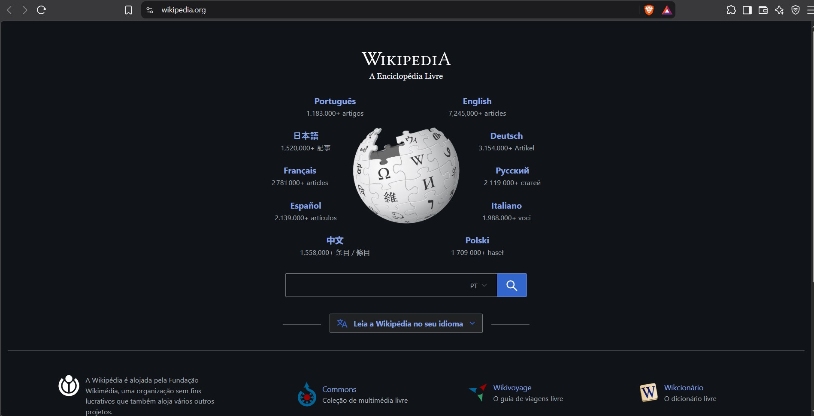
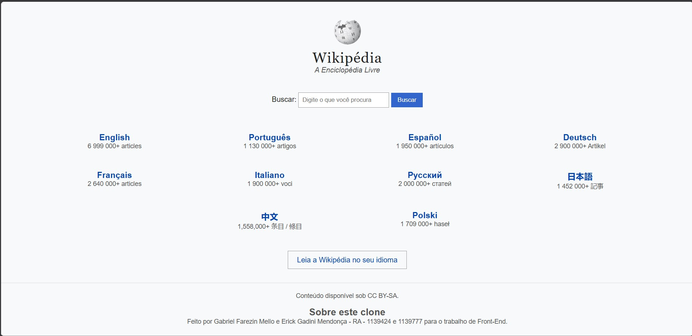
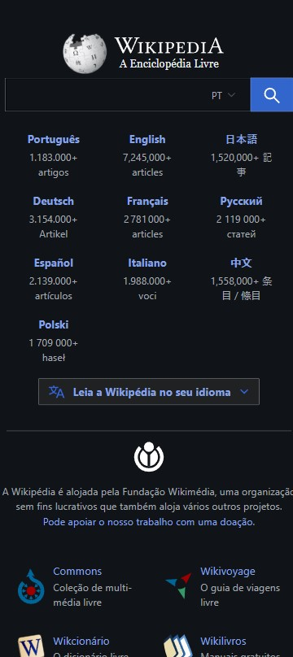
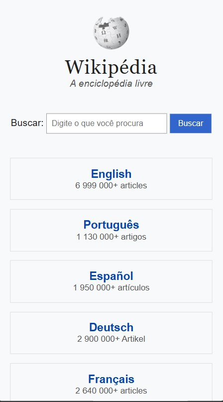
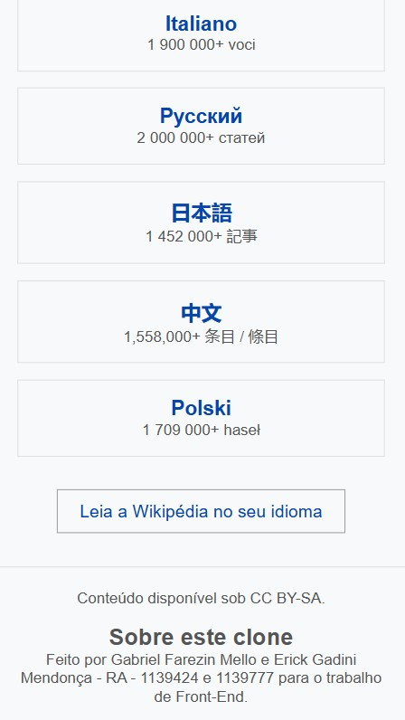

Trabalho G1 Front-End - Clone da Wikipédia

Nomes: Gabriel Farezin Mello e Erick Gadini Mendonça

RA: 1139424 e 1139777

Site de referência: https://www.wikipedia.org

Escolhemos a página inicial da Wikipédia porque é uma página só e tem um formulário, que é a busca.

Checklist da Parte 1

1.1 Estrutura HTML semântica e acessível - feito

1.2 Fidelidade visual à referência - feito

1.3 CSS: seletores, box model e variáveis - feito

1.4 Responsividade: Flexbox e mobile first - feito

1.5 Personalização e originalidade - feito

1.1 Estrutura HTML semântica e acessível

Na página original da Wikipédia o conteúdo é dividido em cabeçalho (nome e lema), conteúdo (idiomas, globo e busca) e rodapé (texto sobre a Fundação Wikimedia e links para outros projetos). Por isso usamos header, main e footer. Os idiomas são links de navegação, então usamos nav em vez de section. O globo é uma imagem e por isso usamos img com alt descrevendo a imagem. No original a busca é um campo com seletor de idioma e um botão com lupa, sem o texto Buscar aparecendo. No nosso clone deixamos o texto Buscar visível, e ele tem label ligado ao campo pelo for e pelo id. No validador do W3C apareceu que a section da busca não tinha título e que os h3 pulavam o h2, então colocamos um h2 escondido na busca e os erros sumiram.

1.2 Fidelidade visual à referência

Copiamos a organização geral do original: título e lema em cima, idiomas, busca, botão de idiomas e rodapé. Usamos os mesmos 10 idiomas, título com fonte com serifa, links azuis, o globo e o botão Leia a Wikipédia no seu idioma. No desktop os idiomas ficam sem caixa, como no original.

Diferenças e o motivo de cada uma:

- O print do original foi tirado com o navegador no modo escuro, e o site muda de acordo com o tema. O nosso clone só tem o tema claro, com fundo cinza claro.
- No original o globo fica grande no meio dos idiomas, e os idiomas ficam em duas colunas em volta dele. No nosso o globo é pequeno em cima do título e os idiomas ficam em linhas, porque é mais fácil de fazer responsivo com Flexbox.
- Os números de artigos dos idiomas estão diferentes dos atuais do original.
- O título do original usa letras maiúsculas menores (small caps) com uma fonte própria. Usamos a fonte Georgia porque é gratuita e parecida.
- A busca do original tem seletor de idioma (PT) e botão com lupa. A nossa tem o texto Buscar, o campo e um botão com texto, sem seletor.
- O botão do original tem ícone e uma setinha. O nosso é só o texto.
- O rodapé do original tem a Fundação Wikimedia e links para outros projetos (Commons, Wikivoyage, Wikcionário). O nosso só tem a licença e a parte Sobre este clone.

Original no desktop:

Nosso clone no desktop:

Original no celular:

Nosso clone no celular (parte de cima):

Nosso clone no celular (parte de baixo):

1.3 CSS: seletores, box model e variáveis

Criamos variáveis no :root para as cores (link, azul do botão e cinza dos textos) e para a fonte do título, assim se quiser mudar uma cor é só mudar em um lugar. Usamos seletor de elemento (body, footer), de classe (.card, .busca, .idiomas), descendente (header h1, .card a, .busca input) e pseudo-classe (.busca button:hover, .card a:hover h3). No box model usamos margin e padding zerados no começo com box-sizing border-box, para a largura já contar o padding e a borda. Depois usamos padding dentro dos cards e botões, border nas caixas dos cards e margin auto para centralizar o globo. Também comentamos os blocos do CSS.

1.4 Responsividade: Flexbox e mobile first

Fizemos o CSS primeiro para o celular, e ele funciona sem nenhuma media query, com os cards um embaixo do outro. Usamos Flexbox na busca e na lista de idiomas. Depois colocamos uma media query com min-width de 768px, que deixa os cards lado a lado (4 por linha) e tira a borda deles. Testamos no celular (F12 do Chrome) e no desktop e funcionou nos dois.

1.5 Personalização e originalidade

No rodapé colocamos a seção Sobre este clone, com nossos nomes e matrículas. Ela não existe no site original.
